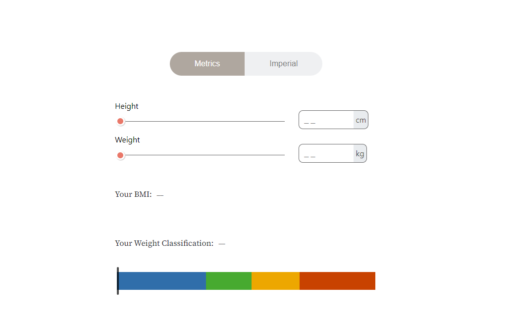
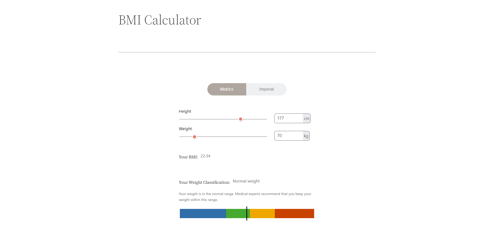
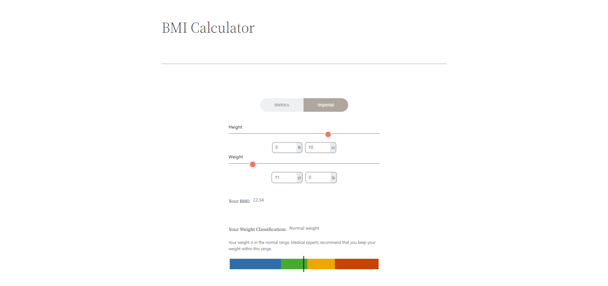

### About The Project

This is a wordpress plugin for Calculatin BMI online.

### Built With

* [Wordpess](https://wordpress.org/)
* [PhP](https://www.php.net/)
* [JQuery](https://jquery.com)

### Installation
1. Place this <b>[Custom_Bmi_Calculator_shortcode]</b> shortcode anywhere in site to show calculator.

### Usage
  1. User Can check their BMI in metrics system.
    - Height (cm)
    - Weight (kg)
    
  2. User can check their BMI in Imperial system
    - Height (ft inch)
    - Weight (st lb)
    

## Contact

ExpertCoder - codeiexper82@gmail.com

Project Link: [https://github.com/codeiexpert/Hr-zone]

